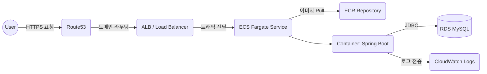

# 🛠️ 유일한 포트폴리오 – Backend API

> 프론트엔드에서 사용하는 데이터 API 서버입니다.  
> AWS ECS Fargate + RDS + ALB + ECR + Terraform 으로 인프라가 구성되어 있습니다.

<br>

## 🚀 핵심 포인트

| 구분 | 내용 |
|------|------|
| **Framework** | Spring Boot + JPA (MySQL) |
| **Architecture** | Layered Architecture (Controller → Service → Repository) |
| **배포 방식** | Docker 이미지 → AWS ECR → ECS Fargate 무중단 배포 |
| **Database** | AWS RDS MySQL, 초기 seed data(data.sql) 자동 주입 |
| **보안** | `.env` + AWS Secret Manager(전환 계획), VPC Private Subnet |
| **네트워크 구성** | Public Subnet(ALB) ↔ Private Subnet(ECS & RDS) |
| **HTTPS 적용** | Route 53 + ACM으로 SSL 인증 자동화 |
| **자동 로그 관리** | CloudWatch Logs로 컨테이너 로그 수집 |
| **CORS 정책 관리** | 환경별 allowed origins 분리 |

<br>

### ⭐️ 특징
Docker 기반 → 실행 환경에 영향 없는 일관된 배포
- ECS Fargate → 서버 없이 컨테이너만 실행 (EC2 관리 X)
- VPC Endpoints 적용 → ECR / S3 private 네트워크 이미지 pull
- Terraform으로 AWS 인프라 전체를 코드로 관리(IaC)

<br>

## 🚀 Production API

| URL | Description |
| --- | --- |
| https://api.uniquehan.com | API Root |
| https://api.uniquehan.com/_health | Health Check |
| https://api.uniquehan.com/api/main/full | Portfolio Main Data |
| https://api.uniquehan.com/api/about/full | Portfolio About Data |

> 특정 경로는 DB 데이터에 따라 변동될 수 있음.

<br>

## 🛠️ Tech Stack

| Category | Tech |
|----------|------|
| Language / Framework | **Java 21**, Spring Boot 3.x, JPA |
| DB | **AWS RDS (MySQL 8.4)** |
| Infra | **AWS ECS Fargate + ECR + ALB + Route53 + ACM (SSL)** |
| IaC | **Terraform** |
| Build | Gradle |
| Container Runtime | Docker |

<br>

## 📁 Project Structure

```plaintext
src/main/java/com.portfolio.myportfolioappback
├─ controller
├─ domain
├─ service
├─ dto
├─ repository
├─ util
└─ config (CORS / ENV / DB)
```

<br>

## 🔐 Environment Variables

로컬 실행: `.env.local`  
배포 실행: `.env.production` (Terraform → ECS 환경변수로 주입됨)

> 운영환경에서 절대 `.env` 파일이 git에 올라가지 않습니다.

<br>

## 📦 AWS Infra Flow (Production)



<br>

## 🐳 Docker Build

```sh
docker build -t portfolio-api .
docker run -p 8080:8080 portfolio-api
```